# Preview Navigation Architecture

This page documents the revision-aware preview navigation design in Clear Writer. The implementation uses compiler metadata plus the committed Paged.js DOM.

## Design Goals

- Keep the generated document HTML free of custom navigation anchors.
- Make editor selection navigation match the preview revision actually visible on screen.
- Survive rerenders caused by images, page breaks, and pagination changes.
- Keep the implementation small enough to reason about and test.
- Avoid modifying the committed page DOM after Paged.js finishes rendering.

## High-Level Flow

```mermaid
flowchart LR
  A[CodeMirror selection change] --> B[Editor manager captures revision]
  B --> C[Compiler builds HTML + source manifest]
  C --> D[Preview controller stores manifest and revision]
  D --> E[Exact pagination render]
  E --> F[Paged.js commits final page DOM]
  F --> G[Committed preview index is built]
  G --> H[Navigation coordinator resolves line to target]
  H --> I[Preview viewport scrolls target near the top]
```

## Implementation Details

### 1. Selection-only editor events

`src/editor/createEditor.ts` emits a selection callback only when the selection changes and the document text does not. That keeps typing, autosave, and cursor movement separate from navigation requests.

### 2. Revision-aware navigation requests

`src/ui/editor-manager.ts` passes the current editor revision to the preview navigation path. The revision is the guard that tells the coordinator whether a request belongs to the preview that is already committed.

### 3. Compiler-side manifest generation

`src/compiler/index.ts` returns a `CompiledPreview` object containing:

- the generated HTML;
- an in-memory manifest of source blocks, line ranges, element paths, and priorities.

The manifest is not emitted as custom HTML attributes. It exists only in memory so the output stays clean and export-friendly.

When Clear Writer builds a merged document from multiple section files, the same compiler path also receives section source segments. Those segments let the compiler rebase manifest entries back to the original file and line range before the preview index is committed.

### 4. Committed preview indexing

`src/preview/RenderEngine.ts` sends the manifest into the exact render path after Paged.js has finished. Once the page DOM is committed, `src/preview/navigation/CommittedPreviewIndex.ts` maps manifest entries to the rendered pages using Paged.js references like `data-ref` and `data-split-from`.

This is the core of the current navigation pipeline:

- the compiler knows where blocks came from;
- Paged.js knows where those blocks ended up;
- the committed index joins the two only after the render is stable.

### 5. Coordinator gating

`src/preview/navigation/PreviewNavigationCoordinator.ts` accepts navigation requests only when the committed preview revision matches the requested editor revision. If a newer render is in flight, the request is queued or discarded rather than jumping to stale content.

### 6. Viewport placement

`src/preview/PreviewViewport.ts` scrolls the resolved block near the top of the preview with a small inset instead of centering it. That gives a more predictable reading position and avoids the visual drift that was showing up with deep pagination changes.

## Current Guarantees

The navigation design is built around the committed preview state:

- the HTML emitted by the compiler stays semantically clean;
- the preview is resolved from committed DOM state, not from stale source hints;
- navigation is tied to a specific editor revision;
- only one small coordinator owns the decision to reveal a target.

## Maintenance Notes

- Keep source-to-preview metadata in memory unless there is a strong new requirement to serialize it.
- Keep the committed preview index build isolated to the render completion path.
- If page layout behavior changes, verify both the manifest ranges and the committed page mapping.
- If a future feature needs additional navigation anchors, extend the compiler manifest first and keep the preview DOM clean.
