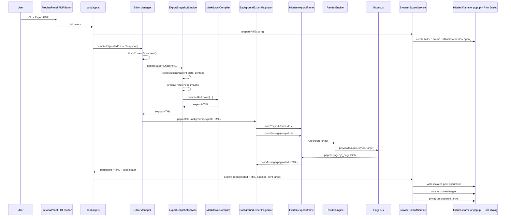

# Exporting And Browser PDF Print Architecture

This page documents how Clear Writer currently exports PDF output through the browser print pipeline. It is written for maintainers who need to understand which modules are connected, what gets triggered by the UI, and why the feature works the way it does today.

## Current Behavior

The current PDF feature is a browser print export, not a server-side PDF renderer and not a direct PDF file writer. Clear Writer prepares a durable document snapshot, paginates that snapshot in a separate hidden same-origin iframe with Paged.js, transfers the resulting page HTML to an isolated print target, injects print-specific CSS, and calls the browser's `print()` API. The browser print dialog is responsible for the final "Save as PDF" or physical print action. The visible live preview is not replaced by the export pagination pass.

The export service prefers a hidden iframe as the print target and only falls back to a blank popup when that iframe cannot be created in the current browser session.

Word export is implemented in `src/services/ExportDocxService.ts`, but the active browser runtime intentionally disables it. `BrowserExportService.saveDocx()` returns a failure response and the UI marks Word export unavailable, so the unsupported feature does not affect the normal writing startup path.

## Primary Modules

| Module | Responsibility in PDF export |
| --- | --- |
| `src/ui/components/PreviewPanel.ts` | Declares the `#btn-export-pdf` toolbar button in the preview pane. |
| `src/boot/app.ts` | Wires the PDF button, prepares the print target early, manages button state, calls the editor manager, and delegates to the platform export service. |
| `src/ui/editor-manager.ts` | Flushes unsaved editor changes, compiles a durable export snapshot, delegates background pagination, verifies pages exist, and returns paginated HTML. |
| `src/services/ExportSnapshotService.ts` | Builds export HTML from workspace data and current editor content, preloads image assets, and compiles Markdown through the normal compiler. |
| `src/compiler/index.ts` and compiler plugins | Convert Markdown into sanitized HTML with Clear Writer-specific transforms such as section wrappers, images, lists, custom styles, metadata, and table styling. |
| `src/ui/BackgroundExportPaginator.ts` | Creates the hidden pagination iframe, sends the export snapshot, receives the paginated HTML, and cleans up the frame. |
| `src/boot/export-pagination-frame.ts` | Boots the minimal iframe document and runs the export-only Paged.js render. |
| `src/preview/PreviewController.ts` | Owns visible preview rendering and revision-aware navigation. It is not used as the export transport. |
| `src/preview/RenderEngine.ts` | Runs Paged.js, applies page CSS, heading numbering, TOC, special headings, margin box post-processing, typography, list, and table CSS. |
| `src/preview/PagedJsAdapter.ts` | Wraps Paged.js `Previewer`, manages render sessions, timeouts, resize listener cleanup, and stale render protection. |
| `src/preview/CssGenerator.ts` | Generates the Paged.js page, margin, header/footer, TOC, typography, list, and table CSS used by preview pagination. |
| `src/platform/runtime.ts` | Creates the browser `Platform` and installs `BrowserExportService` as `platform.exportService`. |
| `src/platform/BrowserExportService.ts` | Creates/writes the hidden print target, falls back to a popup if needed, copies styles, injects print CSS, waits for resources, and invokes `print()`. |
| `src/platform/pdf-print-css.ts` | Generates print-only CSS that makes the Paged.js pages map cleanly to browser print pages. |
| `src/platform/types.ts` | Defines the `DocumentExportService`, `PdfExportDocument`, and related platform contracts. |

## End-To-End Flow



## Trigger Path

The user-facing trigger starts in `src/ui/components/PreviewPanel.ts`, where the preview toolbar includes:

- `#btn-export-pdf` for browser PDF export.
- `#btn-export-docx` for Word export, currently marked unavailable by the active browser export service.

`src/boot/app.ts` wires the PDF button during `bootApp(platform)`. The handler first checks `platform.exportService.support.pdf`. In the current browser runtime this is `true` because `src/platform/runtime.ts` creates `new BrowserExportService()`, and `BrowserExportService.support` is `{ pdf: true, docx: false }`.

When the button is clicked, `boot/app.ts`:

1. Disables the button and sets the status to `preparing`.
2. Calls `platform.exportService.preparePdfExport?.()` before doing asynchronous work.
3. Fails early with a user notice if no print target can be prepared.
4. Calls `editorManager.compilePaginatedExportSnapshot()`.
5. Sets the status to `exporting`.
6. Calls `platform.exportService.exportPdf(...)`.
7. Sets the status to `exported` or `failed`.
8. Restores the button to `idle` after a short timeout.

The early print-target preparation is important. Clear Writer prefers an invisible iframe so the user does not see a second copy of the document. If the iframe target cannot be created, the service falls back to opening a blank popup during the user gesture, keeps the handle, and later writes the export document into that same target.

## Durable Snapshot Path

`EditorManager.compilePaginatedExportSnapshot()` in `src/ui/editor-manager.ts` is the main orchestration method for PDF export. It first calls `compileExportSnapshot()`, which:

1. Calls `flushCurrentDocument()` to save any unsaved CodeMirror content.
2. Reads `state.current.projectRef`, `isFullDocMode`, `activeFile`, and `sections`.
3. Opens the active workspace through `platform.workspaceRepository.open(projectRef)`.
4. Calls `src/services/ExportSnapshotService.ts` with the workspace session, asset resolver, active document mode, section tree, and current editor value where relevant.

`ExportSnapshotService.compileExportSnapshot()` then chooses between two export shapes:

- Full document mode or no active file: it reads all non-folder section files from the workspace, preserves section order and page-break flags, builds one document with `buildFullDocumentMarkdown()`, preloads images, and compiles the combined Markdown. Both the live full-document preview and PDF export use this same `ExportSnapshotService` path.
- Single section mode: it uses the current editor value for the active section when available, wraps it through `renderDocumentSection()`, preloads images, and compiles that section.

Image preloading is handled before compilation by scanning Markdown and HTML image references. The service calls `assetResolver.preloadImages(imagePaths)`, which lets the active platform resolve project images to blob URLs before Paged.js or the browser print window needs them.

In full-document mode the snapshot reader limits workspace section reads to four concurrent operations. That keeps large projects responsive without changing the order of the final document. If a section cannot be read, export fails with a list of the missing paths instead of silently dropping content.

## Compilation Path

The snapshot service uses `compileMarkdown` from `src/compiler/index.ts`. That compiler is the same source-to-HTML path used by the preview, so PDF export inherits the app's normal document semantics:

- Markdown parsing and GitHub-flavored Markdown support.
- Sanitized HTML handling.
- Section wrappers and source metadata.
- Metadata substitution.
- Markdown image handling and attributes.
- List marker normalization.
- Table style selection.
- Custom inline and custom block style transforms.
- TOC placeholders.

This is why the PDF path starts from Markdown and settings rather than simply printing the editor or copying arbitrary UI DOM.

## Pagination Path

After compiling the export HTML, `EditorManager.compilePaginatedExportSnapshot()` calls the background paginator through the export orchestration controller:

```ts
await this.backgroundExportPaginator.paginate({ html, pageSetup, typographySetup, listSetup, tableSetup });
```

This pagination pass uses the same compiler and rendering primitives as the live preview, but it runs in a separate document. The visible preview remains available and is not used as a mutable staging area for export.

`RenderEngine.runRender(...)` does the heavy layout work:

1. Invalidates stale render generations so older Paged.js jobs cannot commit over newer export content.
2. Builds page CSS with `generatePageCss(pageSetup)`.
3. Creates a temporary off-screen container.
4. Wraps the compiled HTML in a DOM node.
5. Applies image fallbacks.
6. Applies heading numbering.
7. Applies special heading processing.
8. Applies table of contents rendering.
9. Starts a Paged.js render session through `PagedJsAdapter.beginPreview(...)`.
10. Waits for Paged.js with a timeout.
11. Retires Paged.js page listeners before moving completed pages.
12. Post-processes margin boxes for header/footer visibility and Markdown images.
13. Applies typography, list, and table dynamic CSS.
14. Commits the completed `.pagedjs_page` DOM into the active render target; for export, that target belongs to the hidden pagination frame.

Once background pagination completes, `compilePaginatedExportSnapshot()` requires a fully rendered result and verifies that the returned HTML contains at least one `.pagedjs_page`. If pagination is stale, times out, or degrades after a Paged.js error, the controller retries once with a fresh snapshot and then fails instead of treating the degraded result as a successful PDF export. If no page exists, it throws `PDF export pagination produced no printable pages.`

If the preview renderer reports a stale render while export is compiling, `EditorManager` retries once against the newest state before failing. That protects against races where a live preview update overtakes the export job during compilation.

The returned export document contains:

```ts
{
  html: paginatedHtml,
  pageSetup: state.current.pageSetup,
  isPaginated: true
}
```

The important detail is that `html` is no longer raw compiled Markdown HTML. It is the already-paginated Paged.js DOM returned by the hidden export frame.

## Browser Export Service Path

`BrowserExportService.exportPdf()` receives the paginated HTML and current settings. In the current implementation, only `html` and `pageSetup` are used directly by the browser print service because typography, list, table, and margin styles have already been generated into document styles during pagination. The method still accepts the full settings set because the `DocumentExportService` platform contract is broader than the current browser implementation.

The service then:

1. Uses the already-prepared hidden iframe print window, or calls `preparePdfExport()` if no target was supplied.
2. Returns `false` if no print target exists.
3. Copies the active stylesheets and inline styles into the print document so the isolated export matches the live preview.
4. Wraps the paginated HTML in `<main id="clear-writer-pdf-document">` and preserves the `#paged-stage` wrapper.
5. Injects print CSS from `buildPdfPrintCss(pageSetup)`.
6. Writes a complete HTML document into the prepared print target.
7. Focuses the target only when it is a visible popup fallback.
8. Registers `afterprint` cleanup so the hidden iframe is removed or the popup is closed after printing.
9. Waits for print-document stylesheets and images, and waits for fonts in parallel so the font timeout does not add to the resource timeout.
10. Uses three `requestAnimationFrame()` ticks to let layout settle.
11. Calls `print()` on the target window.
12. Resolves `true` once the print call has been made.

The print service does not know how to paginate the document itself. Its job is to host and print the pages produced by the export pagination frame.

PDF performance diagnostics are available through `window.clearWriterPerf.snapshot()`. Relevant buckets include `pdfExport:snapshot`, `pdfExport:pagination`, `pdfExport:css`, `pdfExport:resources`, `pdfExport:orchestration-total`, and `pdfExport:browser-total`. CSS fallback buckets beginning with `pdfPrintCssFallback:` identify when the full linked stylesheet had to be retained.

These counters are intended for maintainers and future profiling work. They make it easier to tell whether a slowdown is coming from reading the workspace, paginating the document, copying CSS, or waiting for the browser to open the print dialog.

## Print CSS Responsibilities

`src/platform/pdf-print-css.ts` generates CSS only for the isolated print document. It is separate from `src/preview/CssGenerator.ts`.

`generatePageCss()` in `CssGenerator.ts` tells Paged.js how to create document pages:

- Page size and margins.
- Header and footer margin boxes.
- Header/footer text, metadata, and page counters.
- TOC page-number targets.
- Preview-only guideline overlays.
- Section page breaks.
- Header/footer hiding rules.

`buildPdfPrintCss()` in `pdf-print-css.ts` tells the browser how to print the already-created Paged.js pages:

- Sets `@page size` from `pageSetup.paperWidth` and `pageSetup.paperHeight`.
- Sets browser print margins to `0` because margins are already inside each Paged.js page.
- Removes app layout margin, padding, transforms, shadows, borders, and preview spacing.
- Forces `.pagedjs_page`, `.pagedjs_sheet`, and `.pagedjs_pagebox` to the exact millimetre dimensions.
- Preserves Paged.js' completed page flow without adding browser-level page breaks.
- Removes the final page break from the last page.
- Enables exact color printing with `print-color-adjust: exact` and `-webkit-print-color-adjust: exact`.

Browser-native print headers and footers are not controlled by Clear Writer. The generated CSS explicitly notes that they are controlled by the browser print dialog.

## Settings And State Used By PDF Export

PDF export reads settings from `state.current` at the time of export:

- `pageSetup`: passed into pagination and print CSS. This controls paper size, margins, header/footer rows, TOC settings, special headings, and page guidelines.
- `typographySetup`: applied by `RenderEngine.applyTypographySetup()` as dynamic CSS.
- `listSetup`: applied by `RenderEngine.applyListSetup()` as dynamic CSS.
- `tableSetup`: applied by `RenderEngine.applyTableSetup()` as dynamic CSS.
- `projectMetadata`: used during margin content and metadata substitution.
- `sections`: used to build full-document order, section wrappers, page breaks, and per-section header/footer visibility.
- `projectRef` and `activeFile`: used to open the workspace and decide whether to export the full document or the current section.

## Failure Modes

The current PDF flow has a few explicit failure boundaries:

- Print target unavailable: `preparePdfExport()` returns `null`; the UI shows "PDF export could not open its save window."
- No open project: `compileExportSnapshot()` throws `No project is open.`
- Section read failure in full document mode: `ExportSnapshotService` reports which sections could not be read.
- Pagination produced no pages: `compilePaginatedExportSnapshot()` throws before calling print.
- Pagination degraded or became stale: PDF export fails before calling print; the live preview may still retain a readable fallback page.
- Browser export returned `false`: the print target is cleaned up if possible and the UI reports that PDF export was not completed.
- Unexpected errors: the print target is cleaned up if possible, the button state becomes failed, and a notice tells the user that the document remains unchanged.

## Validation Coverage

The current behavior is protected by these tests:

- `test/export-snapshot.test.cjs`: verifies durable export snapshots preserve sections, page breaks, current editor content, and bounded full-document workspace reads.
- `test/browser-export-service.test.cjs`: verifies PDF support is enabled, DOCX is unavailable in the active browser runtime, popup-blocked export returns `false`, hidden iframe preparation is preferred, the prepared target is reused, the print call occurs, the isolated print document contains only export markup, `afterprint` cleanup is registered, and CSS fallback metrics are recorded when stylesheet inspection fails.
- `test/pdf-print-css.test.cjs`: verifies print CSS uses millimetre page sizes, removes transforms/margins, sets page breaks, sizes Paged.js elements, and documents browser print-dialog ownership.
- `test/fixtures/step10-browser-smoke.ts`: exercises the app through the browser UI and confirms clicking `#btn-export-pdf` invokes the browser PDF mechanism.

Useful verification commands:

```bash
npm test
npm run test:browser-smoke
```

## Architectural Notes

The PDF implementation is intentionally layered:

- UI code owns the user action and button state.
- `EditorManager` owns data integrity and export orchestration.
- `ExportSnapshotService` owns durable document assembly.
- The compiler owns Markdown-to-HTML semantics.
- `RenderEngine` owns pagination fidelity for both visible preview and the isolated export frame.
- The platform export service owns browser-specific popup and print behavior.
- Print CSS owns the final mapping from Paged.js pages to browser print pages.

This separation keeps the export path consistent with the live preview while preventing export work from mutating visible preview state. It also means that most visual fidelity changes should be made in the preview rendering and CSS generation layers, while iframe messaging, popup fallback, print timing, and browser behavior changes belong in `BackgroundExportPaginator`, `BrowserExportService`, and `pdf-print-css.ts`.

The current code also keeps the export pipeline observable. It tracks snapshot time, pagination time, CSS extraction time, resource waiting time, orchestration time, and the browser-print phase. Those metrics are useful when a future reader needs to answer a very practical question: is the slowdown coming from reading the workspace, paginating the document, copying CSS, or waiting for the browser print dialog?

## Known Current Limits

- The app does not write a PDF file directly. The browser print dialog creates or sends the final output.
- A hidden iframe is used as the preferred print target. Popup permission is only needed if the browser cannot create that iframe target and the service falls back to a separate window.
- Browser print settings can still affect the final PDF, especially built-in headers/footers and user-selected scaling.
- DOCX export is present in code but the current browser export service marks DOCX as unavailable with `support.docx === false`.
- A worker-mode pagination transport remains available for the platform contract, but the current browser PDF button path uses `BackgroundExportPaginator` and the isolated `?export-frame=true` entry point before calling `BrowserExportService`.
